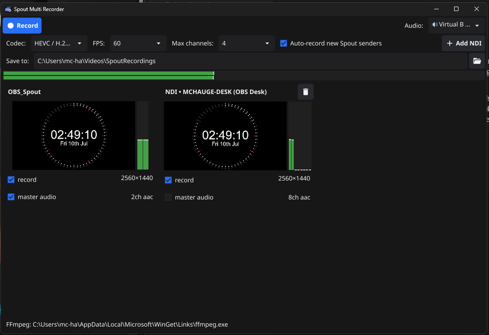

# Spout Multi Recorder

Records **all [Spout](https://spout.zeal.co/) video streams** on a PC — plus any **[NDI](https://ndi.video)® sources** on the network, **UVC webcams**, and **Blackmagic DeckLink** capture cards — to disk simultaneously, each stream to its own file, with flexible per-channel audio.

Written in Go, with the [Spout2 SDK](https://github.com/leadedge/Spout2) (SpoutDX, vendored under `internal/spout/`) via cgo, Media Foundation for webcams and the DeckLink COM API for capture cards (both via small cgo shims), WASAPI audio capture via [malgo](https://github.com/gen2brain/malgo), FFmpeg for encoding, and a [Fyne](https://fyne.io) desktop UI.



## Features

- Records any number of channels at once, each at its native resolution, to `<sender>_<timestamp>.<ext>`. Live preview cards with per-channel VU meters.
- **Folder per recording** (optional, on by default): each session goes into its own timestamped subfolder of the output directory, so all the streams that were recorded together stay together.
- **Embedded timecode** (optional, on by default): each file's start timecode is the wall-clock time of day (a `tmcd` track in MP4/MOV, a `TIMECODE` tag in MKV), so all files from one session — including channels that joined mid-session via auto-record — line up frame-accurately in any NLE that syncs by timecode.
- **DaVinci Resolve project export** (optional, on by default): stopping a session writes `.drp`, `.xml` and `.fcpxml` project files next to the recordings — see [DaVinci Resolve workflow](#davinci-resolve-workflow).
- Robust to sources dropping out: recording continues with **black frames** (and silence) at constant framerate, and picks the stream back up when the source returns — even at a new resolution (frames are centered/cropped).
- **Auto-record**: while a session is running, new Spout senders are automatically armed and get their own file. You can even hit Record with zero senders and let them join as they start up.
- Settings persist between runs (`%APPDATA%\SpoutMultiRecorder\config.json`, log next to it).

### Video sources

- **Spout**: every sender on the machine is discovered automatically and appears as a preview card within a second (up to **Max channels** are auto-armed).
- **NDI** — full-bandwidth NDI *and* NDI|HX: added manually via the **Add NDI** button, which lists the sources discovered on the network. Added sources are remembered across restarts and removable via the 🗑 button on the card. Receivers connect by source name, so they survive the sending application restarting (reconnects automatically, including on a new address). Requires the [NDI runtime](https://ndi.video/tools/) on the machine; HX decoding is handled by the runtime.
- **Webcam (UVC)** — added via **Add Webcam**, which lists the connected cameras (via Media Foundation). **Resolution** defaults to *Auto* — the highest resolution the camera can sustain at the recording frame rate (so a 1080p30/720p60 camera set to 60 fps records 720p rather than a stuttering 1080p) — or pick an explicit mode from the dropdown. MJPEG/YUY2/NV12 are decoded and converted to BGRA. The dialog also offers any **audio endpoint** (🎤 input or 🔊 speaker loopback, same as master audio) as this channel's native audio, preselecting the mic whose name matches the camera. Survives USB unplug/replug (reconnects automatically).
- **DeckLink** — Blackmagic SDI/HDMI capture cards, added via **Add DeckLink**. Uses the driver's **automatic input-format detection**, so the resolution/frame rate follow the incoming signal (and re-lock if it changes). Embedded SDI audio is captured up to 16 channels. Requires the [Blackmagic Desktop Video](https://www.blackmagicdesign.com/support/family/capture-and-playback) driver; without it the button reports that the driver was not found.
- **Web streams** — RTMP, RTSP (plus `rtspt://` to force TCP transport), HLS (`http(s)://…m3u8`), SRT, UDP and anything else your FFmpeg build can pull, added via **Add Stream** (URL + optional name). The stream is decoded through FFmpeg into the normal pipeline, so it gets a preview card, VU meters, black-frame dropout handling and timecode like every other source, and reconnects automatically with backoff if the stream drops or stalls. Embedded stream audio is recorded by default (up to 16 channels). Note: protocol support depends on the FFmpeg build (e.g. SRT needs a build with libsrt — the gyan.dev "full" build has it), and web streams carry their protocol's inherent latency, so their timecode marks *arrival* on this machine, not the sender's clock.

### Audio

- One **master audio source** — any input device or speaker loopback (🔊 "what you hear") — selectable in the toolbar, with a stereo VU meter.
- **Per-channel audio choice** via the **master audio** checkbox on each card:
  - *Checked* (default for Spout, which carries no audio): the master source is muxed into that channel's file.
  - *Unchecked* (default for NDI, DeckLink and webcams with a mic selected): the channel records its **own native audio** — embedded NDI audio, embedded SDI audio, or the webcam's microphone; Spout channels record without an audio track.
- **Multichannel native audio**: the source's channel count is preserved — 2/4/8/16 channels (capped at 16), converted to 48 kHz s16 and silence-padded during dropouts so files never desync. DeckLink SDI audio in particular can carry up to 16 channels. The channel count locks when a recording starts; if the source changes mid-recording the stream is adapted (extra channels dropped, missing ones silent).
- Each card shows exactly what will be recorded (e.g. `2ch aac`, `8ch opus`, `16ch pcm`, `no audio`) plus a live per-channel VU meter beside the preview — one bar per audio channel for native NDI audio, a vertical mirror of the master meter when master audio is selected. No meter = no audio track.

### Codecs (selectable in the UI)

| Preset | Container | Audio | Notes |
|---|---|---|---|
| H.264 / HEVC (auto hardware) | MP4 | AAC | NVENC → QuickSync → AMF, x264/x265 fallback. AAC caps at 8 audio channels (auto-downmix). |
| AV1 (auto hardware) | MP4 | AAC | NVENC → QuickSync → AMF, SVT-AV1 software fallback. Smaller files at equal quality; HW AV1 needs recent silicon (NVENC: RTX 40-series, AMF: RDNA3+, QSV: Arc/Meteor Lake+). |
| H.264 / HEVC / AV1 + Opus | MKV | Opus | Same video encoders; Opus carries the full channel count (~64 kbit/s per channel). |
| ProRes 422 HQ, DNxHR HQ, MJPEG | MOV | PCM | Editing-friendly; PCM keeps all channels uncompressed. |

## Runtime requirements

- Windows 10/11 x64, DirectX 11 capable GPU.
- `ffmpeg.exe` — next to `SpoutMultiRecorder.exe` or on `PATH` (e.g. `winget install ffmpeg`, or the [gyan.dev](https://www.gyan.dev/ffmpeg/builds/) "essentials" build).
- For NDI: the [NDI runtime](https://ndi.video/tools/) (bundled with NDI Tools). Optional — without it, only the NDI features are unavailable.
- For DeckLink: the [Blackmagic Desktop Video](https://www.blackmagicdesign.com/support/family/capture-and-playback) driver. Optional — without it, only the DeckLink features are unavailable.
- For webcams: Media Foundation, present on all normal Windows editions. On Windows N/KN editions install the [Media Feature Pack](https://support.microsoft.com/topic/media-feature-pack-list-for-windows-n-editions-c1c6fffa-d052-8338-7a79-a4bb980a700a).

## Using it

1. Start the app. Running Spout senders appear automatically; add other sources with **Add NDI**, **Add Webcam**, **Add DeckLink** or **Add Stream** (RTMP/RTSP/HLS/SRT URL).
2. Pick the **Audio** master source (🔊 = speaker loopback, 🎤 = input) — the VU meter confirms signal — and set the per-card **master audio** checkboxes as needed.
3. Pick **Codec**, **FPS**, **Max channels** and the output folder.
4. Tick **record** on the channels you want, press **Record**, later **Stop**. Every armed channel becomes its own file.

Good test senders: the *Spout Demo Sender* from the Spout distribution, OBS (Spout2 plugin or NDI output), Resolume, TouchDesigner.

## DaVinci Resolve workflow

With **Folder per recording**, **Embed timecode** and **Resolve project** enabled (all default), every session folder is a self-contained multicam package:

```
SpoutRecordings/
└── 2026-07-10_13-45-14/
    ├── OBS_Studio_2026-07-10_13-45-14.mp4
    ├── Resolume_2026-07-10_13-45-14.mp4
    ├── 2026-07-10_13-45-14_ATEM_Project.drp
    ├── 2026-07-10_13-45-14_MultiCam_Timeline.xml
    └── 2026-07-10_13-45-14_MultiCam_Clip.fcpxml
```

Ways in, most to least reliable:

1. **`_MultiCam_Timeline.xml`** (FCP7 timeline) — *File → Import → Timeline*. A timeline with **every stream on its own video/audio track**, aligned by timecode and visible side by side. This is Resolve's most dependable interchange import. For a true multicam clip, select the imported clips in the media pool, right-click → *New Multicam Clip Using Selected Clips* → Angle Sync: **Timecode**.
2. **`_ATEM_Project.drp`** — the same project format the Blackmagic ATEM Mini ISO writes. Double-click it (or *Project Manager → Import Project*) and Resolve creates a project with every stream in the media pool (timecode-aligned) and a program timeline. Note: like an ATEM project with no live switching, the timeline shows just the first stream — the value is the ready-made project + media pool. Keep the `.drp` next to the media files, it references them by name.
3. **`_MultiCam_Clip.fcpxml`** — *File → Import → Timeline*. Contains a real **multicam clip** with one angle per stream. Resolve's FCPXML multicam import is historically hit-and-miss; if it comes in flattened, use the `.xml` or timecode sync instead.
4. **Timecode sync** — always works regardless of project files: drop the media files in the media pool, select them, right-click → *New Multicam Clip Using Selected Clips* → sync by **Timecode**.

Notes: the start timecode is the wall-clock time of day, so files also sync against other timecode-jammed sources recorded on the same machine. The MKV (Opus) presets store timecode as a tag rather than a `tmcd` track and MKV support in Resolve is limited — prefer MP4 or MOV presets for editing workflows.

## Building

1. Install [Go](https://go.dev/dl/) 1.26 or later (see `go.mod`).
2. Install a MinGW-w64 C/C++ toolchain (needed by cgo for the Spout SDK, webcam and DeckLink shims, and audio):
   - Easiest: [MSYS2](https://www.msys2.org), then in the MSYS2 shell: `pacman -S mingw-w64-ucrt-x86_64-gcc`
   - Add `C:\msys64\ucrt64\bin` to your `PATH`.
   - No extra SDKs are required: the Media Foundation (webcam) and DeckLink headers/import libraries all ship with mingw-w64 or are vendored (`internal/decklink/dl_com.h`).
3. Build:

```powershell
.\build.ps1
```

or manually:

```powershell
$env:CGO_ENABLED="1"; go build -ldflags "-H windowsgui -s -w" -o dist\SpoutMultiRecorder.exe .
```

Note for LLVM/clang MinGW toolchains (llvm-mingw): the cgo link flags reference `-lstdc++`; either use a GCC-based MinGW build, or copy `libc++.a` to `libstdc++.a` in the toolchain's `lib` directory.

## Releases (CI)

Releases are built by [GoReleaser](https://goreleaser.com) via GitHub Actions (`.github/workflows/release.yml`): cross-compiled from Ubuntu with the [llvm-mingw](https://github.com/mstorsjo/llvm-mingw) toolchain, statically linked, and published as a zip with checksums.

To cut a release:

```bash
git tag v1.0.0
git push origin v1.0.0
```

Every push/PR also runs a cross-build + tests via `.github/workflows/ci.yml`. For a local dry run (Linux/WSL with llvm-mingw on PATH): `goreleaser release --snapshot --clean`.

## App icon

The icon is generated by `go run ./tools/icongen` (writes `internal/assets/icon.png`, embedded as the Fyne window/taskbar icon). The exe icon, version properties (company, copyright, product name — see `winres/winres.json`) and application manifest come from a `.syso` resource that GoReleaser generates at release time, stamped with the tag version (see `.goreleaser.yaml`). It is not committed; for a local build with the icon/metadata, generate it once:

```bash
go install github.com/tc-hib/go-winres@latest
go-winres make --in winres/winres.json --arch amd64
```

## Notes & limitations

- Float-format Spout senders (e.g. RGBA16F/RGBA32F) are rare and not converted; 8-bit BGRA/RGBA senders (the default) are fully supported.
- If a source changes resolution mid-recording the file keeps its original size; frames are centered (padded/cropped), since a video file cannot change resolution mid-stream.
- Audio/video both start when you press Record and stay aligned; extremely long sessions may accumulate a small drift (audio is clocked by the source, video by the wall clock). NDI audio at rates other than 48 kHz is resampled with a simple nearest-sample pass.
- The Spout2 SDK sources in `internal/spout/` are BSD-licensed by Lynn Jarvis — see `internal/spout/SPOUT_LICENSE.txt`.
- NDI® is a registered trademark of Vizrt NDI AB. The app loads the NDI runtime DLL dynamically at runtime (nothing NDI-related is compiled in or redistributed); without the runtime installed, NDI features are simply unavailable.
- DeckLink support uses a minimal, hand-written COM interface header (`internal/decklink/dl_com.h`) — **not** the Blackmagic SDK. Its IIDs, CLSIDs and enum constants were read from the installed Desktop Video driver's own type library, so no SDK download is needed to build. The app reaches the driver purely via COM (`CoCreateInstance`); without Desktop Video installed, DeckLink features are simply unavailable. Blackmagic, DeckLink and Desktop Video are trademarks of Blackmagic Design Pty. Ltd.
- Webcam support uses Windows Media Foundation (system component); frames are decoded/converted to BGRA by the OS.
